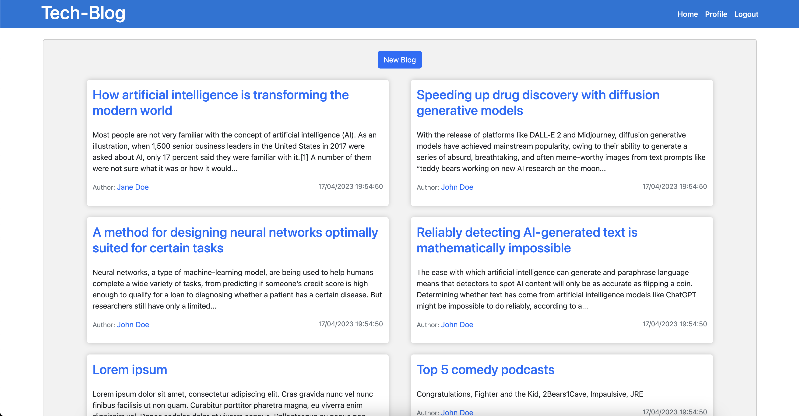

# Tech-Blog

## Table of Contents
- [Description](#description)
- [Installation](#installation)
- [Usage](#usage)
- [License](#license)
- [Contributing](#contributing)
- [Tests](#tests)
- [Questions](#questions)

## Description
This is a tech-blog website built using node.js, express.js, MySQL/sequelize and handlebars. The website is designed to provide a platform for users to share their experiences and knowledge related to technology. During the development of this website, I gained experience in configuring models with primary keys and foreign keys to ensure proper data structuring and integrity. I also learned about the importance of website features such as user authentication and authorization, which I implemented to only allow authenticated users to create new blog posts or add comments to existing ones. The website provides the following features: view all blog posts without logging in, create an account to log in and log out, must be logged in to create new blog posts, add comments to existing blog posts and view user profiles.

## Deployment
<a href="https://johns-blogsite.herokuapp.com/">Webpage Link</a>

## Installation
To install and run this website on your local machine: 
* Clone the repository 
* Install the dependencies using 'npm install'
  * create a mySQL database and update the .env file with your db credentials, (Note, this can be done by adjusting the server file -- change line 48 in the server.js file to force: true. Then rerun 'npm install'. After running npm install, turn "force: false" back.). 
* After creating your database, seed it by running 'npm run seed'. 
* Finally, start the server using 'npm start' and navigate to your local host on port 3001.

## Usage
The user can view blogposts from the homepage, they can navigate to a users profile page to view all their blogposts, navigate to a specific blogpost to view all the comments. 

Deployed Site: 

Login Dummy Account:
* email: johndoe@gmail.com
* password: 123456

## License
This project is licensed under the MIT License.

## Questions
If you have any questions, please contact me at abounassar.john@gmail.com or visit my github page at https://github.com/john-abou .

